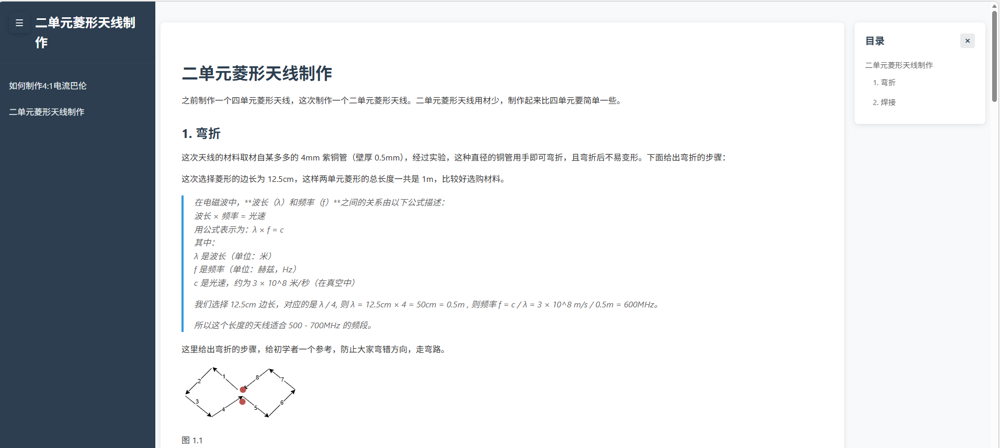

# GitBook 解析器

一个用于解析 markdown 文件并生成 HTML 网站或 PDF 文件的工具。



## 功能特性

- 📚 解析 gitbook 的 markdown 文件结构
- 📚 解析 notion 导出压缩包的 markdown 文件结构
- 🌳 构建目录树结构
- 🎯 支持标题锚点跳转
- 🌐 生成 HTML 网站（左侧目录树，右侧内容）
- 📄 生成 PDF 文件
- 🔍 支持 gitbook 标签
- 💡 支持语法高亮


## 安装

```bash
# 安装命令支持 html
pnpm install bookforge -g
# 配置 puppeteer 支持pdf
pnpm approve-builds -g
```

## 构建

```bash
pnpm build
```

## 使用

```bash
# 生成 HTML 网站
bookforge html --input ./docs --output ./dist/html

# 生成 PDF 文件
bookforge pdf --input ./docs --output ./dist/pdf

# 同时生成 HTML 和 PDF
bookforge all --input ./docs --output ./dist
```

## 开发

```bash
# 运行测试
pnpm test
```

## 示例

项目包含了一个完整的示例文档在 `docs/` 目录中，你可以直接使用它来测试功能。

## TODO
- [x] 支持notion导出压缩包解析
- [ ] 支持 mermaid 语法

## 许可证

[MIT](LICENSE)