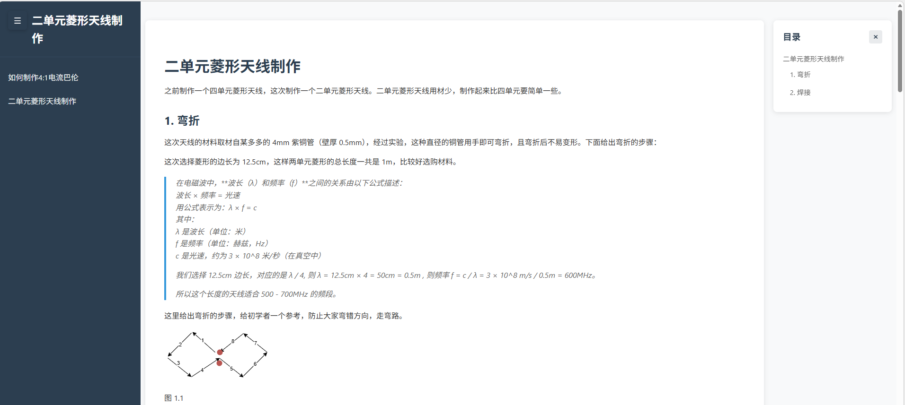

# GitBook 解析器

一个用于解析 markdown 文件并生成 HTML 网站或 PDF 文件的工具。



## 功能特性

- 📚 解析 gitbook 的 markdown 文件结构
- 📚 解析 notion 导出压缩包的 markdown 文件结构
- 🌳 构建目录树结构
- 🎯 支持标题锚点跳转
- 🌐 生成 HTML 网站（左侧目录树，右侧内容）
- 📄 生成 PDF 文件
- 🔍 支持 gitbook 标签
- 💡 支持语法高亮
- 📈 支持 mermaid 图形
- 🧮 支持 latex 公式


## 安装

```bash
# 安装命令支持 html
pnpm install bookforge -g
# 配置 puppeteer 支持pdf
pnpm approve-builds -g
```

## 构建

```bash
pnpm build
```

## 使用

```bash
# 生成 HTML 网站
bookforge html --input ./docs --output ./dist/html

# 生成 PDF 文件
bookforge pdf --input ./docs --output ./dist/pdf

# 同时生成 HTML 和 PDF
bookforge all --input ./docs --output ./dist
```

## 语义搜索（Embedding）

构建 HTML 站点时可以开启 embedding 功能，为每个页面预计算语义向量，实现基于语义的全站搜索。该功能完全可选，不开启时仅使用关键词匹配搜索。

### 安装可选依赖

```bash
pnpm install @xenova/transformers
```

### 启用 embedding

在构建命令中添加 `--embedding` 开关：

```bash
# 使用默认模型（Xenova/all-MiniLM-L6-v2，英文）
bookforge html --input ./docs --output ./dist/html --embedding

# 使用多语言模型（推荐中文场景）
bookforge html --input ./docs --output ./dist/html \
  --embedding \
  --embedding-model Xenova/multilingual-e5-small

# 自定义输出文件名和批大小
bookforge html --input ./docs --output ./dist/html \
  --embedding \
  --embedding-model Xenova/multilingual-e5-small \
  --embedding-output embedding-index.json \
  --embedding-batch-size 16
```

### 参数说明

| 参数 | 默认值 | 说明 |
|------|--------|------|
| `--embedding` | 关闭 | 开启 embedding 生成 |
| `--embedding-model` | `Xenova/all-MiniLM-L6-v2` | ONNX embedding 模型名称 |
| `--embedding-output` | `embedding-index.json` | embedding 索引输出文件名 |
| `--embedding-batch-size` | `8` | 向量计算批大小 |

### 推荐模型

| 模型 | 维度 | 语言 | 说明 |
|------|------|------|------|
| `Xenova/all-MiniLM-L6-v2` | 384 | 英文 | 默认模型，轻量快速 |
| `Xenova/multilingual-e5-small` | 384 | 多语言 | 支持中文，推荐 |
| `Xenova/multilingual-e5-base` | 768 | 多语言 | 更高精度，体积较大 |
| `Xenova/paraphrase-multilingual-MiniLM-L12-v2` | 384 | 多语言 | 多语言释义模型 |

### 工作原理

1. **构建时**：使用 `@xenova/transformers`（ONNX Runtime）在 Node.js 端为每个页面计算语义向量，输出 `embedding-index.json`
2. **运行时**：客户端加载预计算的向量数据，通过 CDN 动态加载 `@xenova/transformers`，在浏览器端计算查询向量并进行余弦相似度匹配
3. **降级策略**：若未开启 embedding 或模型加载失败，自动回退到基于 `search-index.json` 的关键词搜索

## 开发

```bash
# 运行测试
pnpm test
```

## 示例

项目包含了一个完整的示例文档在 `docs/` 目录中，你可以直接使用它来测试功能。

## TODO
- [x] 支持notion导出压缩包解析
- [x] 支持 notion database 解析
- [x] 支持 mermaid 语法

## 已知问题
### notion database 标题重名问题
在 notion database 中，如果多个页面有相同的标题，则相同的标题的页面会展示成同一个。所以如果想导出的 database 正常渲染，请确保每个页面的标题都是唯一的。

## 许可证

[MIT](LICENSE)