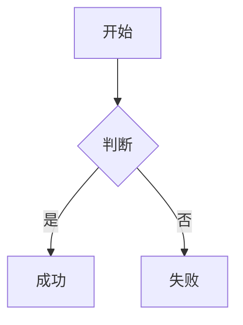

结论先给出：**是的，上述 `marked.use({ extensions })` 的写法可以适配 `marked@17`**，但有**几个 v17 必须注意的点**，否则会踩坑。

下面我按 **“能用 / 要改 / 易踩坑”** 来说明。

---

## 一、整体结论（marked v17）

✔ **extensions API 没有破坏性变更**
你看到的这些写法在 `v4 → v17` 一直是稳定的：

```ts
marked.use({
  extensions: [
    {
      name,
      level,
      start,
      tokenizer,
      renderer
    }
  ]
})
```

**block / inline / tokenizer / renderer 的行为在 v17 完全一致**

---

## 二、marked@17 必须注意的变化点（重点）

### 1️⃣ marked@17 是 **纯 ESM**

❌ 旧写法（v17 不支持）：

```ts
const marked = require('marked')
```

✔ 正确写法：

```ts
import { marked } from 'marked'
```

如果你在：

* Node ≥ 18
* TS / bundler（Vite / Webpack / ESBuild）

👉 **没有任何问题**

---

### 2️⃣ renderer 的参数签名更严格（TS 下）

在 v17 中，**renderer 的参数已经完全 token 化**。

#### ❌ 老教程常见写法（TS 会报错）

```ts
renderer(token) {
  return `<mark>${token.text}</mark>`
}
```

#### ✔ 推荐写法（v17 + TS）

```ts
renderer(token: any) {
  return `<mark>${token.text}</mark>`
}
```

或者更规范一点：

```ts
import type { Tokens } from 'marked'

renderer(token: Tokens.Generic) {
  return `<mark>${token.text}</mark>`
}
```

> JS 用户完全不用管，TS 才需要注意

---

### 3️⃣ tokenizer 返回值必须完整（v17 更严格）

你示例里的 **`raw` 是必须的**，这一点在 v17 中更严格了：

```ts
return {
  type: 'highlight',
  raw: match[0],   // 必须
  text: match[1]
}
```

❗ 缺 `raw` 会导致：

* 死循环
* 内容重复解析

---

## 三、你上面几个示例逐一评估

### ✅ 行内扩展（==高亮==）

```ts
level: 'inline'
start()
tokenizer()
renderer()
```

✔ **v17 完全 OK**

---

### ✅ 块级扩展（:::warning）

```ts
level: 'block'
tokenizer()
renderer() {
  return `<div>${marked.parse(token.text)}</div>`
}
```

✔ **v17 完全 OK**

> 这是官方推荐模式（block 内再 parse 子 markdown）

---

### ✅ walkTokens

```ts
marked.use({
  walkTokens(token) {
    if (token.type === 'link') {
      token.href += '?x=1'
    }
  }
})
```

✔ **v17 完全 OK**

---

### ⚠️ renderer 覆盖默认行为（code / link / heading）

```ts
marked.use({
  renderer: {
    code(code, lang) { ... }
  }
})
```

在 v17 中：

* JS：仍然可用
* TS：**签名变成 token 版**

#### 推荐 v17 写法

```ts
renderer: {
  code(token) {
    return `<pre><code>${token.text}</code></pre>`
  }
}
```

---

## 四、marked@17 推荐的 extension 写法模板（你可以直接用）

```ts
import { marked, type Tokens } from 'marked'

marked.use({
  extensions: [
    {
      name: 'highlight',
      level: 'inline',
      start(src) {
        return src.indexOf('==')
      },
      tokenizer(src) {
        const match = /^==([^=]+)==/.exec(src)
        if (!match) return

        return {
          type: 'highlight',
          raw: match[0],
          text: match[1]
        }
      },
      renderer(token: Tokens.Generic) {
        return `<mark>${token.text}</mark>`
      }
    }
  ]
})
```

## mermaid 



## 公式

> 这得益于 DTMB 使用的 470-700Mhz 频段，使公式中的 `L共模​` 值不需要特别大，所以绕制 3.5 圈即可。
> `L共模​` 跟匝数和线径的关系的数学表达式：
>$$
\boxed{
L(\mu H) = \frac{N^2  D^2}{18D + 40l}
}
$$

> **公式 3.1.1.1**
> 符号说明：
> 
| 符号 | 含义 | 单位 |
| --- | --- | --- |
| (N) | 匝数 | — |
| (D) | 线圈平均直径 | **cm** |
| (l) | 绕组长度 | **cm** |
| (μH)|微亨 | **10⁻⁶H**|

---

## 五、一句话总结

> **你前面给的 extensions 示例在 marked@17 语义上是完全兼容的**
> 唯一需要注意的是：
>
> * ✅ 使用 ESM `import { marked }`
> * ⚠️ TS 下 renderer / tokenizer 类型更严格
> * ❗ 一定要返回 `raw`

如果你现在是 **TS + pnpm + Node 18/20**（你之前的上下文很像这个环境），
👉 这套写法是 **官方推荐 + 长期稳定** 的。

如果你愿意，我也可以 **按你现在的 marked 版本 + tsconfig** 给你写一份 **完全无 TS 报错的 extension 模板**。
