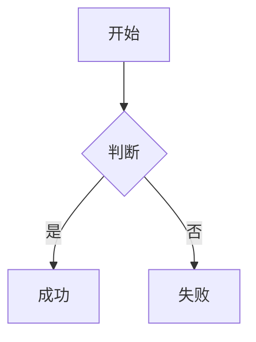

# 支持特性说明

---

## 带有语言的块级代码块


✔ **extensions API 没有破坏性变更**
你看到的这些写法在 `v4 → v17` 一直是稳定的：

```typescript
marked.use({
  extensions: [
    {
      name,
      level,
      start,
      tokenizer,
      renderer
    }
  ]
})
```


---

## 没有语言的代码块

```
const marked = require('marked')
```

---

## mermaid 图形



## 公式

> 这得益于 DTMB 使用的 470-700Mhz 频段，使公式中的 `L共模​` 值不需要特别大，所以绕制 3.5 圈即可。
> `L共模​` 跟匝数和线径的关系的数学表达式：
>$$
\boxed{
L(\mu H) = \frac{N^2  D^2}{18D + 40l}
}
$$

> **公式 3.1.1.1**
> 符号说明：
> 
| 符号 | 含义 | 单位 |
| --- | --- | --- |
| (N) | 匝数 | — |
| (D) | 线圈平均直径 | **cm** |
| (l) | 绕组长度 | **cm** |
| (μH)|微亨 | **10⁻⁶H**|

---

## gitbook 标签


 **你前面给的 extensions 示例在 marked@17 语义上是完全兼容的**


唯一需要注意的是：


> 使用 ESM `import { marked }`



> TS 下 renderer / tokenizer 类型更严格



> 一定要返回 `raw`



> 如果你现在是 **TS + pnpm + Node 18/20**（你之前的上下文很像这个环境），
> 👉 这套写法是 **官方推荐 + 长期稳定** 的。


