# 支持特性说明

---

## 带有语言的块级代码块


✔ **extensions API 没有破坏性变更**
你看到的这些写法在 `v4 → v17` 一直是稳定的：

```typescript
import { existsSync, mkdirSync } from 'fs';
import { Slogger } from 'node-slogger';
import path, { join } from 'path';
// import { MarkdownParser } from '../core/MarkdownParser';
import type { BookForgeConfig, TreeNode } from '../types';
import { Tpl } from '../utils/tpl';
import type { IBookParser } from '../core/book-parsers/interfaces';
import { getInstance } from '../core/book-parsers/book-parser-factory';
import { cp } from 'fs/promises';


export abstract class AbstractGenerator {
  protected outputDir: string;
  protected input: string;
  protected name: string = '';
  protected logger: Slogger;
  protected bookParser: IBookParser;
  protected title = 'BookForge';
  constructor(config: BookForgeConfig) {
    this.outputDir = config.output;
    this.input = config.input;
    this.title = config.title || this.title;
    this.bookParser = getInstance({
      parseMode: config.mode,
      ignorePatterns: config.skip,
      outputDir: this.outputDir,
      env: config.format,
    });
    this.logger = new Slogger();
  }
  protected abstract doGenerate(treeRoot: TreeNode): Promise<void>;
  public async generate(): Promise<void> {
    // 确保输出目录存在
    if (!existsSync(this.outputDir)) {
      mkdirSync(this.outputDir, { recursive: true });
    }
    const tree = await this.bookParser.parse(this.input);
    await this.doGenerate(tree);
  }

}

```


---

## 没有语言的代码块

```
const marked = require('marked')
```

---

## mermaid 图形



```mermaid
graph TD
  A[开始] --> B{判断}
  B -->|是| C[成功]
  B -->|否| D[失败]
```

## 公式

> 这得益于 DTMB 使用的 470-700Mhz 频段，使公式中的 `L共模​` 值不需要特别大，所以绕制 3.5 圈即可。
> `L共模​` 跟匝数和线径的关系的数学表达式：
>$$
\boxed{
L(\mu H) = \frac{N^2  D^2}{18D + 40l}
}
$$

> **公式 3.1.1.1**
> 符号说明：
> 
| 符号 | 含义 | 单位 |
| --- | --- | --- |
| (N) | 匝数 | — |
| (D) | 线圈平均直径 | **cm** |
| (l) | 绕组长度 | **cm** |
| (μH)|微亨 | **10⁻⁶H**|

---

## gitbook 标签


 **你前面给的 extensions 示例在 marked@17 语义上是完全兼容的**


唯一需要注意的是：


> 使用 ESM `import { marked }`



> TS 下 renderer / tokenizer 类型更严格



> 一定要返回 `raw`



> 如果你现在是 **TS + pnpm + Node 18/20**（你之前的上下文很像这个环境），
> 👉 这套写法是 **官方推荐 + 长期稳定** 的。


